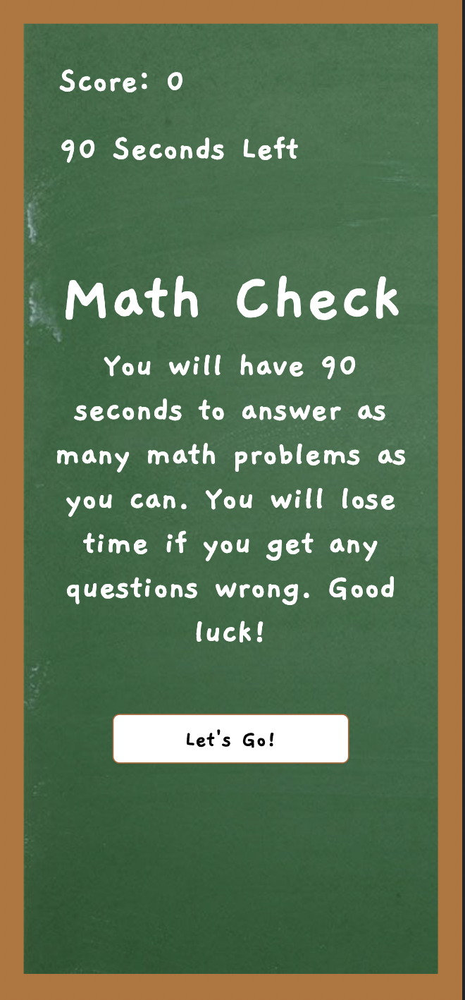
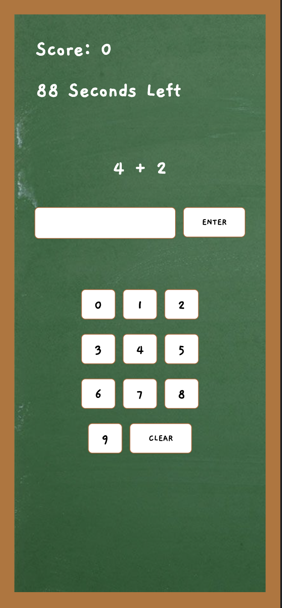
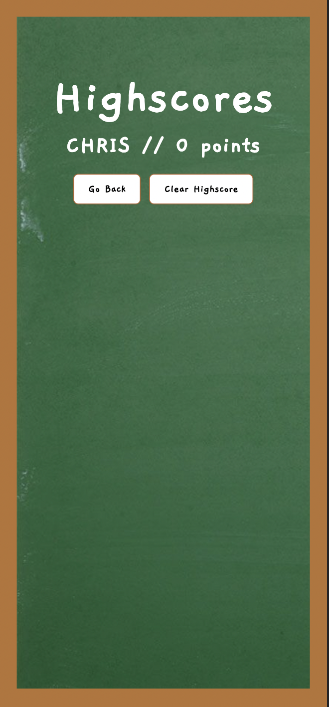

# Math Check
  ## Licensing:
  
  ## Table of Contents 
  - [Description](#description)
  - [Installation](#installation)
  - [Usage](#usage)
  - [Contribution](#contribution)
  - [Testing](#testing)
  - [Questions?](#questions)
  ## Description:
  This web app presents math questions to the user and scores the user's answers for accuracy with MathJS API. The app stores previous scores for the user to keep track of their progress. 
  Technology used include HTML, CSS, JS, and MathJS API.
  ## Installation:
  Please open the index.html file in your default browser to access the app.
  ## Usage:
  This app was designed with 2nd graders in mind. The app, once deployed, is responsive on desktop, tablet, and mobile.
  Desktop:
  
  
  
  Mobile:
  
  
  
  
  ## License:
  
  Copyright © Chris Nguyen. All rights reserved. 
  Licensed under the [MIT](https://opensource.org/licenses/MIT) license.
  ## Contribution:
  Anyone can contribute to this project. Other implementations that could be added include division, question/answer log, and multiple questions at once. I would love to implement word problems in the future.
  ## Testing:
  You can test this application by running it in your default browser and check the console log for any errors.
  ## Questions?
  - Github: [ChrisNguyenT](https://github.com/ChrisNguyenT)
  - Email: chris@chrisnguyen.page 
